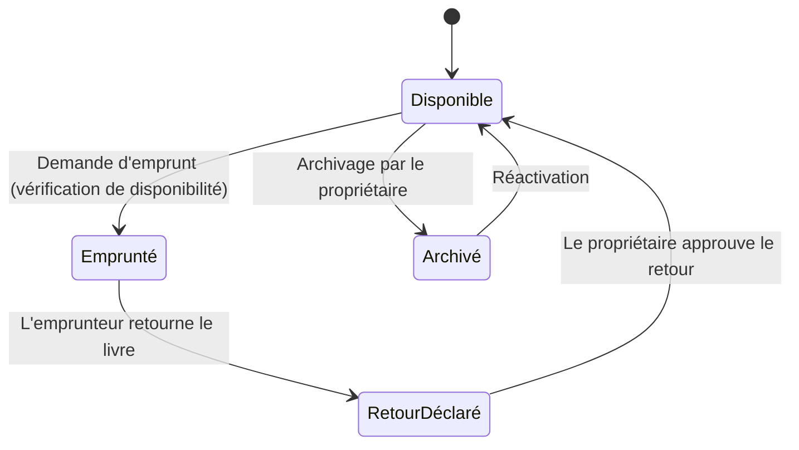
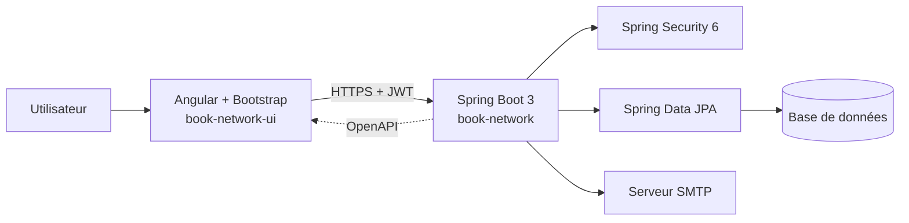

<div align="center">

# Book Social Network

**Plateforme full-stack de partage et d'emprunt de livres entre passionnés de lecture**

Spring Boot 3 · Spring Security 6 · JWT · Angular · Docker · CI/CD


</div>

---

## Table des matières

- [Aperçu](#aperçu)
- [Fonctionnalités](#fonctionnalités)
- [Architecture](#architecture)
- [Stack technique](#stack-technique)
- [Sécurité](#sécurité)
- [Démarrage rapide](#démarrage-rapide)
- [Documentation de l'API](#documentation-de-lapi)
- [Structure du dépôt](#structure-du-dépôt)
- [CI/CD](#cicd)
- [Compétences démontrées](#compétences-démontrées)
- [Feuille de route](#feuille-de-route)
- [Licence](#licence)
- [Auteur](#auteur)

---

## Aperçu

**Book Social Network** est une application web full-stack qui permet aux utilisateurs de gérer leur bibliothèque personnelle et d'échanger des livres au sein d'une communauté de lecteurs.

Le projet couvre l'ensemble du cycle de vie d'un produit logiciel : modélisation métier, API REST sécurisée, interface Angular, conteneurisation et pipeline d'intégration et de déploiement continus.

**Le problème résolu** : un lecteur possède des livres qu'il ne relit plus, un autre cherche à les emprunter. L'application gère tout le parcours, de l'inscription jusqu'à l'approbation du retour, avec des règles de disponibilité garanties côté serveur.

> Capture d'écran de l'application : `docs/images/screenshot-home.png`
>
> 

---

## Fonctionnalités

| Domaine | Description |
|---|---|
| **Inscription** | Création de compte avec validation des données (JSR-303) |
| **Activation par email** | Envoi d'un code de validation sécurisé pour activer le compte |
| **Authentification** | Connexion sécurisée par jeton JWT |
| **Gestion des livres** | Création, modification, partage et archivage |
| **Emprunt** | Vérification automatique de la disponibilité avant tout emprunt |
| **Retour** | Retour des livres empruntés par l'emprunteur |
| **Approbation du retour** | Validation du retour par le propriétaire du livre |
| **Pagination** | Listes paginées conformes aux bonnes pratiques REST |

### Cycle de vie d'un emprunt



---

## Architecture

Le projet suit une approche **mono-repo** avec deux applications distinctes : une API REST et une application Angular.



**Choix de conception**

- **Architecture en couches** (contrôleur, service, repository) avec séparation nette des responsabilités.
- **Contrat d'API généré** : le client Angular est produit avec OpenAPI Generator à partir de la spécification du backend, ce qui élimine les divergences entre les deux applications.
- **Gestion centralisée des erreurs** : exceptions métier personnalisées et handler global pour des réponses d'erreur cohérentes.
- **Configuration par environnement** grâce aux Spring Profiles.

### Diagrammes

| Diagramme | Fichier |
|---|---|
| Diagramme de classes | `diagrammes&pipelines/Diagrammedeclasses.png` |
| Sécurité Spring | `diagrammes&pipelines/Diagrammedesécurité.png` |
| Pipeline backend | `diagrammes&pipelines/Pipelinedebackend.png` |
| Pipeline frontend | `diagrammes&pipelines/Pipelinedefrontend.png` |

---

## Stack technique

### Backend : `book-network`

| Catégorie | Technologies |
|---|---|
| Framework | Spring Boot 3 |
| Sécurité | Spring Security 6, JWT, Keycloak |
| Persistance | Spring Data JPA (avec héritage d'entités) |
| Validation | JSR-303, Spring Validation |
| Documentation | OpenAPI, Swagger UI |
| Conteneurisation | Docker |
| CI/CD | GitHub Actions |

### Frontend : `book-network-ui`

| Catégorie | Technologies |
|---|---|
| Framework | Angular |
| Structure | Architecture par composants, Lazy Loading |
| Sécurité | Authentication Guard |
| Intégration API | OpenAPI Generator pour Angular |
| Style | Bootstrap |

---

## Sécurité

- Authentification **stateless** par jeton **JWT**.
- Configuration Spring Security 6 : chaîne de filtres, routes publiques et protégées.
- Activation de compte par **code de validation envoyé par email**.
- Validation systématique des entrées (JSR-303) pour limiter les données invalides.
- Protection des routes côté Angular avec un **Authentication Guard**.
- Intégration de **Keycloak** pour la gestion d'identité.

---

## Démarrage rapide

### Prérequis

- Java 17 ou supérieur
- Maven 3.9+
- Node.js 18+ et npm
- Docker et Docker Compose

### 1. Cloner le dépôt

```bash
git clone https://github.com/<votre-utilisateur>/book-social-network.git
cd book-social-network
```

### 2. Lancer l'infrastructure (base de données, serveur mail de test)

```bash
docker compose up -d
```

### 3. Démarrer le backend

```bash
cd book-network
./mvnw spring-boot:run -Dspring-boot.run.profiles=dev
```

L'API est disponible sur `http://localhost:8088`.

### 4. Démarrer le frontend

```bash
cd book-network-ui
npm install
npm start
```

L'application est disponible sur `http://localhost:4200`.

> Adaptez les ports, le nom du profil et les variables d'environnement à votre configuration.

---

## Documentation de l'API

La documentation interactive est générée automatiquement avec **OpenAPI** et **Swagger UI** :

```
http://localhost:8088/swagger-ui/index.html
```

Le client Angular se régénère à partir de la spécification :

```bash
cd book-network-ui
npm run gen-api
```

---

## Structure du dépôt

```
book-social-network/
├── book-network/          # API REST Spring Boot
│   ├── src/main/java/     # Code source (controllers, services, repositories, entités)
│   ├── src/main/resources/
│   └── Dockerfile
├── book-network-ui/       # Application Angular
│   ├── src/app/
│   └── Dockerfile
├── docs/
│   ├── diagrams/          # Diagrammes de classes, sécurité, pipelines
│   └── images/            # Captures d'écran
├── .github/workflows/     # Pipelines GitHub Actions
├── docker-compose.yml
├── LICENSE
└── README.md
```

---

## CI/CD

Deux pipelines **GitHub Actions** automatisent le cycle de livraison :

| Pipeline | Étapes |
|---|---|
| **Backend** | Compilation, tests, build de l'image Docker, déploiement |
| **Frontend** | Installation, build de production, build de l'image Docker, déploiement |

---

## Compétences démontrées

- Conception d'un **diagramme de classes** à partir d'exigences métier
- Organisation d'un projet en **mono-repo**
- Sécurisation d'une API avec **Spring Security 6 et JWT**
- Inscription et **activation de compte par email**
- Utilisation de l'**héritage avec Spring Data JPA**
- Couche service et **gestion des exceptions métier**
- Validation avec **JSR-303 / Spring Validation**
- **Pagination** et bonnes pratiques des **API REST**
- **Spring Profiles** pour les configurations par environnement
- Documentation d'API avec **OpenAPI et Swagger UI**
- **Dockerisation** de l'infrastructure
- Mise en place d'un pipeline **CI/CD** et déploiement

---

## Feuille de route

- [ ] Tests d'intégration avec Testcontainers
- [ ] Système de notation et de commentaires sur les livres
- [ ] Notifications en temps réel
- [ ] Recherche avancée et filtres
- [ ] Observabilité (métriques et logs centralisés)

---

## Licence

Ce projet est distribué sous licence **Apache 2.0**. Voir le fichier [LICENSE](LICENSE).

---

## Auteur

**Yassine Bahadi**
Étudiant ingénieur en Génie Logiciel et Systèmes Distribués, ENSET Mohammedia


---

<div align="center">

Si ce projet vous est utile, une étoile sur le dépôt est toujours appréciée.

</div>